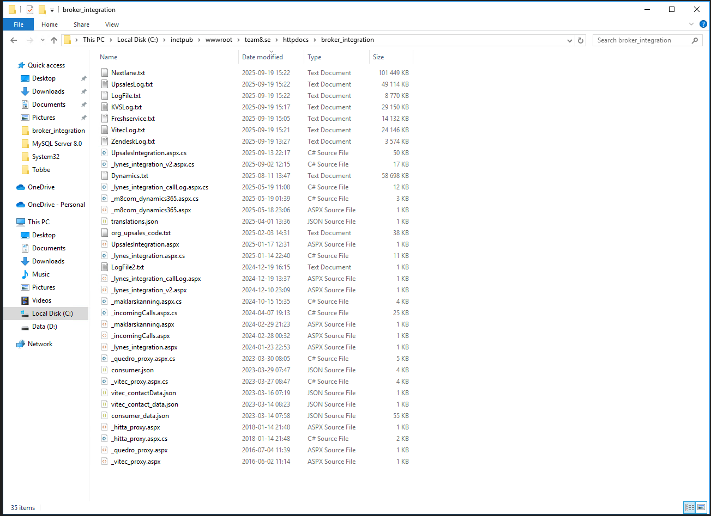
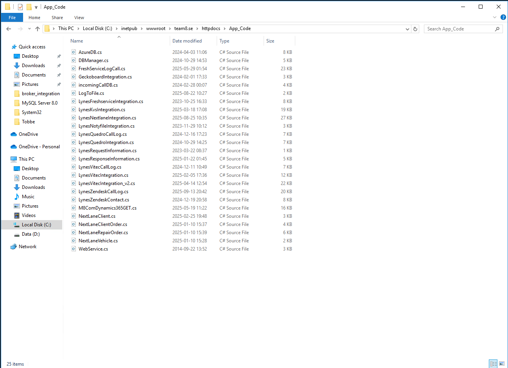

# Dokumentation för broker_integration (Team 8)

Detta dokument är avsett att ligga i ett separat GitHub‑repo för dokumentation. Här sammanfattas alla delar av systemet **broker_integration** på Pyramid‑servern, med fördjupade flödesbeskrivningar och exempel på JSON‑strukturer. Målet är att ge en tydlig vägledning till utvecklare om hur de olika modulerna samverkar, vilka parametrar som skickas och vad som kommer tillbaka.

> **Observera:** Alla externa anrop initieras från aspx‑sidorna i mappen
> `C:\inetpub\wwwroot\team8.se\httpdocs\broker_integration`. Dessa sidor tar emot HTTP‑anrop från Lynes‑växeln (nummeruppslag) eller från M8Com (samtalsloggning) och använder kod i `App_Code` för att hantera logik och integrationer.

## Innehållsförteckning

* [Mappstruktur och miljö](#mappstruktur-och-miljö)
* [Gemensamma datamodeller](#gemensamma-datamodeller)
* [Flödesbeskrivningar per integration](#flödesbeskrivningar-per-integration)
  * [Vitec](#vitec)
  * [Quedro](#quedro)
  * [Notyfile](#notyfile)
  * [Nextlane](#nextlane)
  * [KVS (Svensk Fastighetsförmedling)](#kvs-svensk-fastighetsförmedling)
  * [Freshservice](#freshservice)
  * [Geckoboard](#geckoboard)
  * [Dynamics 365](#dynamics-365)
* [Call‑log‑end‑points](#call-log-end-points)
* [Databasanvändning](#databasanvändning)
* [Exempel på JSON‑strukturer](#exempel-på-json-strukturer)
* [Bilder](#bilder)

## Mappstruktur och miljö

Se huvuddokumentationen för en fullständig beskrivning av filstrukturen, serverns hårdvara och IIS‑konfiguration. Kortfattat ligger webbsidorna i mappen **broker_integration** medan C#‑koden kompileras från **App_Code**. Bilderna i dokumentationen visar dessa mappar och servermiljön.

## Gemensamma datamodeller

### LynesRequestInformation

Används av aspx‑sidorna för att hämta **frånnummer** och **tillnummer** från klienten. Denna modell är enkel och innehåller två strängegenskaper【197140311029220†L1-L4】.

### LynesResponseInformation

Den centrala modellen som alla integrationer bygger upp. Den innehåller namn, bilder, telefonnummer, e‑postadresser, företagsinformation, valfria fält, aktivitetslänkar och en lista med noteringar (ActivityNote). Standardfält initieras med tomma listor i konstruktorn【719042288406091†L67-L84】. Se avsnittet *Exempel på JSON‑strukturer* för en utdata.

### ActivityNote

Aktivitetsnoteringar representerar specifik information knuten till en kontakt, exempelvis en bostad (Vitec/Quedro), ett fordon (Nextlane), en ticket (Freshservice), eller ett ärende (Dynamics). Fälten inkluderar typ (t.ex. `PROPERTY`, `CAR`, `TICKET`), en rubrik, en tidsstämpel, valfri markdown‑text och länk för att öppna posten i källsystemet.

## Flödesbeskrivningar per integration

I flödesbeskrivningarna nedan visas hur varje integration fungerar i praktiken: från HTTP‑anrop via aspx‑sida till uppslag i externa API:er och konstruktion av ett `LynesResponseInformation`‑objekt. För varje modul anges vilka parametrar som används och vilken utdata som returneras.

### Vitec

1. **Anrop:** Lynes‑växeln anropar `lynes_integration_v2.aspx` med `fromNumber`, `toNumber` och `brokerId` i query‑strängen. Vitec används om kundens `vitecCustomerId` är registrerad (M11542 eller via konfiguration).
2. **Parametrar:** Frånnummer normaliseras till internationellt format (+46), och kundens Vitec‑kundnummer läses från `DBManager` om det inte är hårdkodat.
3. **API‑anrop:** I `LynesVitecIntegration` anropas Vitecs REST‑API med Basic Auth. Slår upp personbaserad information, fastighetsobjekt och säljstatus.  
4. **Byggs svar:** Namn, e‑post, telefoner och eventuella bilder fylls i `LynesResponseInformation`. Varje bostad skapar en `ActivityNote` med rubrik (adress eller objektnamn), tidsstämpel (t.ex. försäljningsdatum) och länk till objektet i Vitec.
5. **Returneras:** JSON‑strukturen serialiseras och skickas som svar till Lynes‑växeln, som visar upp kontaktkortet för användaren.

### Quedro

1. **Anrop:** Startas via `lynes_integration_v2.aspx` om brokerId matchar Quedro‑användare.
2. **Parametrar:** Telefonnummer normaliseras (börjar alltid med 0). Query‑strängen `searchfreetext.php?query=...` anropas med Quedro‑API‑nyckel.
3. **API‑anrop:** Första anropet ger en lista av kontakter (konsumenter). Om träff, hämtas **konsumentdata** via `getconsumerdata.php` för att få en lista med objekt som personen är kopplad till (potentiell köpare, säljare, köpare).  
4. **Byggs svar:** Första personen används. `displayName`, `firstName`, `lastName` samt e‑post sätts. `moreInfoUrl` pekar till personens kort i Quedro. Företagsfältet sätts till den mest relevanta bostadstiteln. Varje bostad genererar en `ActivityNote` av typ `PROPERTY` med rubrik (t.ex. adress), en markdown‑lista med information (m², pris, status) och länk till Quedro.
5. **Returneras:** Objektet serialiseras till JSON. Om inget hittas sätts `foundPerson` till `false`.

### Notyfile

1. **Anrop:** Via `lynes_integration_v2.aspx` när brokerId tillhör Notyfile.
2. **Parametrar:** Telefonnummer normaliseras: `+46` ersätts med `0` och eventuella bindestreck tas bort. Anrop till `/contacts?search={phone}` med Bearer‑token.
3. **API‑anrop:** Hämtar första kontaktmatchning.  
4. **Byggs svar:** Om en träff finns sätts `displayName`, `firstName`, `lastName` och `emails`. Eftersom Notyfile inte returnerar objekt skapas inga aktiviteter【618305456474743†L41-L73】.

### Nextlane

1. **Anrop:** Om brokerId är kopplad till bilhandlare startas Nextlane via `lynes_integration_v2.aspx`.  
2. **Parametrar:** Telefonnummer normaliseras med `FormatPhoneNumber` som tar bort +46/46 och lägger till 0, anpassat till Nextlanes krav【191103961875513†L326-L387】.  
3. **API‑anrop:** Funktionen `findClientFromPhone` anropar Nextlanes API: först `/clients?phone={phone}`. Om en kund hittas anropas `/vehicles?client={id}` för fordon, `/orders?client={id}` för orders och `/repairorders?client={id}` för verkstadsärenden.  
4. **Byggs svar:**  
   - **Kundinformation**: namn, adress, telefonnummer och e‑post sätts från klientobjektet.  
   - **Fordon**: varje fordon lägger till en `ActivityNote` med typ `CAR`. Rubrik kan vara bilmodell och registreringsnummer, markdownfält listar årsmodell, miltal, bränsle och länk.  
   - **Order**: varje order ger en `ActivityNote` av typ `ORDER` med rubrik (ordernummer), datum, status och listade produkter【191103961875513†L546-L609】.  
   - **Reparationsorder**: liknande flöde; ger `ActivityNote` av typ `REPAIR` med rubrik och beskrivning av jobb【191103961875513†L684-L754】.  
5. **Returneras:** Ett komplett `LynesResponseInformation`‑objekt med kundinformation och aktiviteter. Om flera Nextlane‑sajter används (ex. MRG), anpassas API‑nyckel i konfiguration.

### KVS (Svensk Fastighetsförmedling)

1. **Anrop:** Initieras via `lynes_integration_v2.aspx` om brokerId motsvarar KVS.
2. **Parametrar:** Telefonnummer konverteras till `00`‑format och ett access token hämtas från Azure AD via `GetAccessToken`【938842210647096†L103-L168】.
3. **API‑anrop:** `/callerinformation/lookup?callingPhoneNumber={from}&receivingPhoneNumber={to}` anropas med Ocp-Apim-Subscription-Key och Bearer‑token.  
4. **Byggs svar:** Svar innehåller `customerResponse` och `employeeResponse`. Modellen `ContactInfo` byggs med namn, roller (kund, anställd), telefon och e‑post samt aktiviteter som listar aktuella objekt (till salu, sålda) för kunder【938842210647096†L212-L315】.  
5. **Returneras:** Om kontakt hittas serialiseras `foundPerson=true` med populärt kontaktkort; annars returneras `foundPerson=false` med felmeddelande.

### Freshservice

#### LynesFreshserviceIntegration

1. **Anrop:** Telefonuppslag via `lynes_integration_v2.aspx` när brokerId är kopplad till Freshservice (helpdesk).  
2. **Parametrar:** Telefonnummer normaliseras och testas i två format (0xxx och +46xxx).  
3. **API‑anrop:** Först söks requesters via Freshservice API (`/requesters?per_page=50&page=n`), sedan hämtas biljetter (`/tickets?requester_id=...`).  
4. **Byggs svar:** Om en requester hittas fylls namn, titel, department/ort (till companyInfo), e‑post och länk till profilen. De fem senaste biljetterna läggs som `ActivityNote` av typ `TICKET` med rubrik (ärenderubrik), tid och länk. En `createActivityUrl` genereras för att starta nytt ärende【126269241649936†L79-L151】.

#### FreshServiceLogCall

Denna fil används inte för uppslag utan för att **skapa** tickets efter avslutat samtal.

1. **Anrop:** `lynes_integration_callLog.aspx.cs` postar samtal till `FreshServiceLogCall.createTicket` när loggning är aktiverad för brokerId. JSON‑payload från Lynes innehåller `fromNumber`, `toNumber`, `duration`, `body` (transkription), `startTime`, `callType`, `summary` och `user`.
2. **Parametrar och AI‑bearbetning:** Om samtalet varar mer än 30 sekunder bestäms ärendegrupp (Juridik/IT) utifrån innehållet; requestern identifieras via `FindRequesterByPhone`【110240176909560†L231-L299】; agentens e‑post hittas via `ExtractM8ComAgent`【110240176909560†L301-L309】. OpenAI anropas för att generera titel och kategorier【110240176909560†L443-L467】【110240176909560†L490-L548】.
3. **Byggs ärende:** En `Ticket` skapas med ämne, beskrivning (HTML genererad från transkription och översatta rubriker), prioritet, status, grupp och taggar. Ärendet skickas till Freshservice via API.
4. **Returneras:** Respons från Freshservice inkluderar `ticket_id`, länk etc., men loggas internt och returneras inte till Lynes.

### Geckoboard

Används för statistisk monitorering: `GeckoboardIntegration.PushToGeckoboard` anropas från vissa logikmoduler för att skicka anonymiserad data (frånnummer, tillnummer, brokerId) till Geckoboard som JSON via Basic Auth【418922140671880†L5-L29】. Data visualiseras sedan i realtid.

### Dynamics 365

Integrationen `M8ComDynamics365GET` (kallad Dynamics i rapporten) hämtar kontakter och ärenden från Dynamics 365:

1. **Anrop:** Startas via `_lynes_integration_v2.aspx` när brokerId är kopplad till Dynamics.
2. **Parametrar:** Telefonnummer normaliseras och skickas som OData‑filter för `mobilephone` och `telephone1`【573992892362798†L21-L67】.
3. **API‑anrop:** Access token via OAuth; sedan begärs kontakter, order och ärenden.  
4. **Byggs svar:** `LynesResponseInformation` fylls med namn, position, e‑post och telefonnr. Orders, ärenden och andra entiteter läggs som `ActivityNote` med rubriker, belopp/status och skapat datum【573992892362798†L87-L151】.  
5. **Returneras:** JSON‑objektet skickas till Lynes. Om flera träffar returneras den första.

## Call‑log‑end‑points

### _lynes_integration_callLog.aspx.cs

Denna aspx‑sida tar emot POST‑anrop från M8Com (Lynes). Payloaden är ett JSON‑objekt med:

- **fromNumber**: uppringande nummer.
- **toNumber**: mottagarnummer.
- **duration**: varaktighet i millisekunder.
- **body**: transkription av samtalet.
- **startTime**: Unix‑tid (ms) när samtalet startade.
- **callType**: `Incoming`, `Outgoing` eller `Missed`.
- **summary**: kort kommentar.
- **user**: agentens namn.

Servern loggar först uppgifterna i `incomingCalls` och skickar sedan notiser till rätt call‑log‑modul beroende på brokerId och nummer (Vitec, Quedro, Freshservice, Zendesk etc.). Responsen är en enkel textsträng som indikerar om loggningen lyckades.

### _lynes_integration_v2.aspx.cs

Denna fil fungerar som **router** för uppslag. Den läser query‑parametrar (`fromNumber`, `toNumber`, `brokerId` och `user`), loggar anropet i `request_log` och kollar sedan inställningar för brokerId. Därefter initierar den relevant integration (Notyfile, Vitec, Quedro, Freshservice, KVS, Zendesk, Nextlane, Dynamics). Om inget hittar sätts `foundPerson` till `false`. Resultatet serialiseras till JSON.

### _incomingCalls.aspx.cs

Tillhandahåller **statistik** i JSON‑format via olika funktioner. Query‑parametern `function` styr vilken rapport som returneras (t.ex. `GetIntegrationCount`, `GetCallsPerDay`, `GetTopLynesCallers`). SQL‑frågorna läser fält från tabellen `incomingCalls` och returnerar antingen listor (integration och antal) eller serier per dag/månad som används i grafer【326552674452854†L15-L118】. Funktionen `SortCallsByReseller` sorterar resultaten och helpermetoder formaterar listor innan de serialiseras【326552674452854†L123-L156】.

## Databasanvändning

Följande tabeller används i dokumenterad kod:

- **incomingCalls** (MySQL och Azure SQL): kolumner `brokerid`, `fromNumber`, `toNumber`, `integration`, `lookupSuccess`, `duration`, `LogDate`, `brokerName`. Fylls av call‑log‑sidorna och används i statistiksidorna【438788190442739†L17-L82】.
- **request_log** (MySQL): loggar varje uppslag via `lynes_integration.aspx` eller `lynes_integration_v2.aspx`. Typiska fält: `id`, `timestamp`, `brokerId`, `fromNumber`, `toNumber`.
- **broker_brokers** (MySQL): innehåller listor över mäklarfirmor (brokerId, företag, kontor). Används i `GetTopLynesCallers`/`GetTopT8Callers` för att mappa brokerId till firmanamn.

## Exempel på JSON‑strukturer

Nedan visas typiska JSON‑strukturer som returneras efter uppslag. Dessa exempel är förenklade men visar de viktigaste fälten i `LynesResponseInformation`.

### Standardkontakt (Vitec/Quedro/Freshservice)

```json
{
  "displayName": "Anna Andersson",
  "firstName": "Anna",
  "lastName": "Andersson",
  "avatar": "https://example.com/avatar.jpg",
  "coverPhoto": "https://example.com/cover.jpg",
  "phoneNumbers": [
    { "title": "Mobil", "type": "WORK", "number": "0701234567" }
  ],
  "emails": [
    { "title": "E-post", "address": "anna@foretag.se" }
  ],
  "companyInfo": { "title": "Mäklare", "value": "Fastighetsbyrån Huddinge" },
  "fields": [
    { "title": "Kundnummer", "value": "12345" }
  ],
  "createActivityUrl": [
    { "title": "Skapa ärende", "url": "https://support.example.com/new?requester=123" }
  ],
  "activityNotes": [
    {
      "type": "PROPERTY",
      "header": "Radhus på Lilla vägen 5",
      "timeStamp": "2025-04-15T10:30:00Z",
      "markdown": "**Bud**: 5 800 000 kr\n\n- 3 rok, 90 m²\n- Inflyttning: 2025-07-01",
      "activityUrl": "https://vitec.example.com/property/123"
    }
  ],
  "foundPerson": true
}
```

### Nextlane‑kontakt

```json
{
  "displayName": "Karl Karlsson",
  "firstName": "Karl",
  "lastName": "Karlsson",
  "phoneNumbers": [
    { "title": "Mobil", "type": "HOME", "number": "0739876543" },
    { "title": "Hem", "type": "HOME", "number": "08-123456" }
  ],
  "emails": [
    { "title": "E-post", "address": "karl@example.com" }
  ],
  "companyInfo": { "title": "Kund", "value": "MRG Bil" },
  "activityNotes": [
    {
      "type": "CAR",
      "header": "VW GOLF (ABC123)",
      "timeStamp": "",
      "markdown": "- Årsmodell: 2022\n- Miltal: 15 000 km\n- Bränsle: Bensin",
      "activityUrl": "https://nextlane.example.com/vehicle/ABC123"
    },
    {
      "type": "ORDER",
      "header": "Order nr 45678",
      "timeStamp": "2024-12-12T08:00:00Z",
      "markdown": "- Status: Pågående\n- Produkter: \n  - Servicepaket\n  - Vinterdäck",
      "activityUrl": "https://nextlane.example.com/order/45678"
    },
    {
      "type": "REPAIR",
      "header": "Reparation ABC123",
      "timeStamp": "2024-05-05T09:00:00Z",
      "markdown": "- Beskrivning: Byte av bromsar\n- Status: Klar",
      "activityUrl": "https://nextlane.example.com/repair/789"
    }
  ],
  "foundPerson": true
}
```

### Call‑log‑payload (till FreshServiceLogCall)

```json
{
  "fromNumber": "+46701234567",
  "toNumber": "+468123456",
  "duration": 90000,
  "body": "Hej, jag har problem med mitt konto ...",
  "startTime": 1700000000000,
  "callType": "Outgoing",
  "summary": "Kundens konto fungerar inte",
  "user": "agent@example.com"
}
```

## Bilder

Följande bilder används för att illustrera miljön och mappstrukturen i dokumentationen:

* **Mappstruktur i broker_integration** – visar katalogen `broker_integration` med filer och mappar:

  

* **Innehåll i App_Code** – visar källfilerna i mappen `App_Code`:

  

* **Serverinformation** – visar Windows Server 2016 med hårdvaruspecifikationer för Pyramid‑servern:

  

* **Nätverksinformation** – visar IP‑konfigurationen på servern:

  

* **IIS‑Manager** – visar IIS‑administrationen där webbplatserna (inklusive team8.se) hanteras:

  
